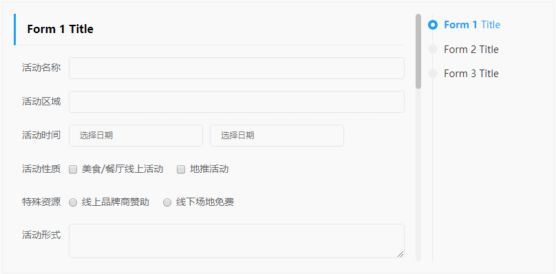

## Demo

https://zhangr16.github.io/zrz-nav-box/

### Preview



## Usage

```vue
<template>
  <nav-box height="360px" :foldable="true">
    <nav-box-pane>
      <div slot="title">Form 1 <strong style="color:#f90">(Html surport)</strong></div>
      <!-- <example-form /> -->
    </nav-box-pane>
    <nav-box-pane title="Form 2 (Fold by default)" :fold="true">
      <!-- <example-form /> -->
    </nav-box-pane>
    <nav-box-pane title="Form 3 (Can't fold)" :foldable="false">
      <!-- <example-form /> -->
    </nav-box-pane>
  </nav-box>
</template>

<script>
import { NavBox, NavBoxPane } from '@zrz-nav-box'

export default {
  components: {
    NavBox,
    NavBoxPane
  }
}
</script>
```

## Props

### nav-box

| Prop      | Type           | Default | Info |
| --------- | -------------- | ------- | ---- |
| height    | String, Number | null    | Navigation wrap box's height. e.g. `500`, `500px` |
| navWidth  | String, Number | null    | Navigation sidebar width. e.g. `160`, `160px` |
| duration  | Number         | 400     | Scroll animation time.
| offsetTop | Number         | 0       | Amount of space between top of screen and the section to active.
| foldable  | Boolean        | false   | Enable child panes foldable

### nav-box-pane

**`<nav-box-pane />` needs to wrap in the `<nav-box />`**

| Prop     | Type    | Default | Info |
| -------- | ------- | ------- | ---- |
| title    | String  | null    | Section title
| foldable | Boolean | -       | Specify the child pane foldable. Only on `<nav-box />` `foldable` is `true`
| fold     | Boolean | -       | Specify the child pane whether fold by default. Only on `<nav-box />` `foldable` is `true`

## Project scrips

```bash
# Develop
yarn run serve

# Build component dist
yarn run build:lib

# Build example page
yarn run build:example
```
